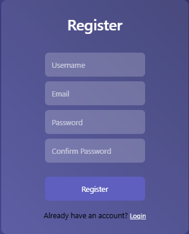
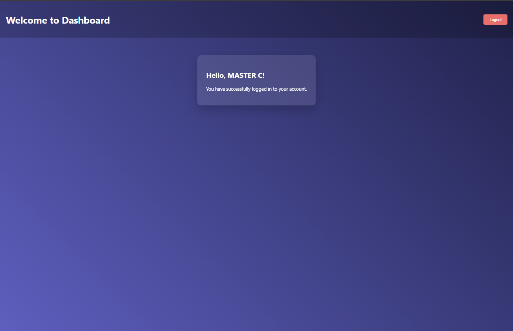

# Login/Register with django

A secure and stylish user authentication system built with Django, featuring an animated interface and local storage for session management.

## Features

- Animated transition between login and register forms
- Secure password handling with Django's built-in hashing
- Client-side password confirmation validation
- CSRF protection
- Responsive design with modern UI
- User session management
- Error notifications and success messages

## Screenshots





## Installation

### Prerequisites

- Python 3.6+
- Django 3.2+

### Setup Instructions

1. Clone the repository
   ```bash
   git clone https://github.com/MASTER-TANKHUN/login_page_django_backend.git
   cd login_page_django_backend
   ```

2. Create and activate a virtual environment (recommended)
   ```bash
   # On Windows
   python -m venv venv
   venv\Scripts\activate

   # On macOS/Linux
   python -m venv venv
   source venv/bin/activate
   ```

3. Install dependencies
   ```bash
   pip install django
   ```

4. Apply migrations to set up the database
   ```bash
   python manage.py makemigrations
   python manage.py migrate
   ```

5. Run the development server
   ```bash
   python manage.py runserver
   ```

6. Access the website with local in your terminal

## Project Structure

```
auth_system/
├── auth_system/           # Project settings folder
│   ├── __init__.py
│   ├── asgi.py
│   ├── settings.py        # Django settings
│   ├── urls.py            # Main URL configuration
│   └── wsgi.py
│── scree_readme           # image for .md
│   ├── Login.png
│   ├── Register.png
│   └── Dashboard.png
├── users/                 # App folder
│   ├── __init__.py
│   ├── admin.py
│   ├── apps.py
│   ├── migrations/
│   ├── models.py
│   ├── tests.py
│   ├── urls.py            # App URL configuration
│   └── views.py           # Views for handling login/register
├── templates/             # HTML templates
│   ├── index.html         # Login/Register page
│   └── dashboard.html     # User dashboard after login
├── manage.py              # Django management script
└── README.md              # This file
```

## How It Works

### Authentication Flow

1. **User Registration**:
   - User fills out the registration form
   - Client-side validation ensures passwords match
   - Form is submitted to Django backend
   - User data is saved with password hashing
   - Success message is displayed and user is redirected to login

2. **User Login**:
   - User enters credentials
   - Django authenticates the user
   - On success, user data is stored in local storage
   - User is redirected to dashboard

3. **Session Management**:
   - User session is maintained in both Django sessions and browser local storage
   - Logout clears both server-side session and local storage

### Security Features

- Passwords are hashed using Django's security system (PBKDF2 with SHA256)
- CSRF protection on all forms
- Input validation on both client and server sides
- Secure session handling

## Customization

### Changing Colors

Edit the CSS in `templates/index.html` and `templates/dashboard.html`. Look for the background gradient:

```css
background: linear-gradient(45deg, #4b6cb7, #182848);
```

### Adding New Fields

1. Update the HTML form in `templates/index.html`
2. Modify the Django view in `users/views.py` to handle new fields
3. Apply migrations if adding fields to the user model

## Troubleshooting

### Common Issues

- **CSRF Verification Failed**: Make sure your forms include the `` tag
- **Database Errors**: Run `python manage.py migrate` to ensure your database is up to date
- **Static Files Not Loading**: Check settings.py for proper static file configuration

### Error Messages

If you see "Username or password is wrong" even with correct credentials, check:
1. That you've applied all migrations
2. That you're using the same username (case sensitive) you registered with

## Developer

- **[MASTER-T](https://github.com/MASTER-TANKHUN)**
- **[claude ai](https://claude.ai)**
